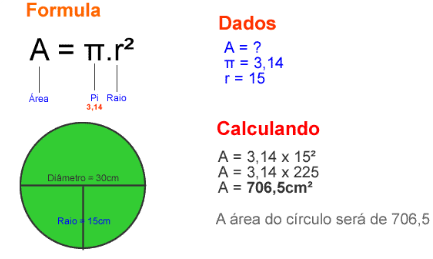

# 1 - Estrutura Sequencial 
[Lista de Exercícios](../../README.md)

## Exercício 06

Faça um Programa que peça o raio de um círculo, calcule e mostre sua área:

[:page_with_curl: Solução](__init__.py)
