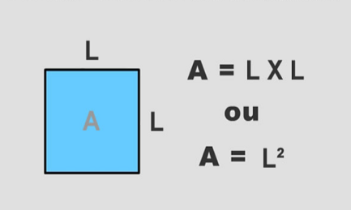

# 1 - Estrutura Sequencial 
[Lista de Exercícios](../../README.md)

## Exercício 07

Faça um Programa que calcule a área de um quadrado, em seguida mostre o dobro desta área para o usuário.

[:page_with_curl: Solução](__init__.py)
