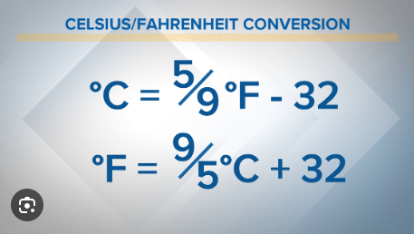

# 1 - Estrutura Sequencial 
[Lista de Exercícios](../../README.md)

## Exercício 10

Faça um Programa que peça a temperatura em graus Celsius, transforme e mostre em graus Fahrenheit.

[:page_with_curl: Solução](__init__.py)
